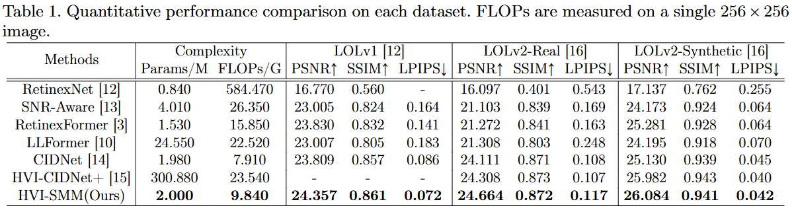

# HVI-SMM: Spatially-Adaptive Correction for Low-Light Image Enhancement



**HVI-SMM establishes a new Real Time SOTA model, outperforming [HVI-CIDNet(CVPR2025)](https://github.com/Fediory/HVI-CIDNet) model.**


## Overview
HVI-SMM is a novel low-light image enhancement framework that introduces a pixel-wise spatially-adaptive correction method based on the HVI color space. Unlike previous global correction approaches, HVI-SMM dynamically generates saturation and brightness correction maps for each pixel, enabling sophisticated local restoration and robust performance across diverse illumination conditions.

## Key Features
- **Spatial Modulation Module (SMM):** Predicts pixel-wise correction intensities for both saturation and brightness, allowing fine-grained local enhancement.
- **HVI Color Space:** Utilizes the HVI color space to overcome the limitations of RGB/HSV in low-light scenarios, reducing color distortion and noise.
- **Intensity Mean Loss:** Introduces a loss function that adaptively balances brightness alignment and detail restoration, focusing the network on structural fidelity.
- **Intermediate Supervision:** Employs intermediate loss to resolve scale ambiguity and stabilize training.

## Project Structure
- `scripts/` : Training, evaluation, and utility scripts
  - `train.py` : Main training pipeline (multi-dataset, distributed, SMM/HVI options)
  - `eval.py` : Evaluation and metric computation
  - `options.py` : Argument parser for all training/eval options
  - `utils.py` : Logging, checkpoint, and helper functions
- `net/` : Model architectures (CIDNet, CIDNet_SSM, HVI transforms, LCA, etc.)
- `loss/` : Loss functions (including Intensity Mean Loss, Perceptual, Edge, etc.)
- `data/` : Dataset loaders and augmentation
- `results/` : Output images, logs, and evaluation results
- `weights/` : Pretrained and training checkpoints

## Training
Example command (see `scripts/options.py` for all options):
```bash
python scripts/train.py --dataset lolv2_syn --batchSize 4 --nEpochs 500 --model_file net/CIDNet_SSM.py --use_gt_mean_loss hvi --use_random_gamma True
```
- Supported datasets: LOL-v1, LOL-v2 (real/syn), SID, SICE, LOL-Blur, etc.
- Multi-GPU: Automatically uses all available GPUs

## Evaluation
- Run `scripts/eval.py` to evaluate trained models on supported datasets.
- Metrics: PSNR, SSIM, LPIPS, and custom metrics (see `scripts/measure.py`).


## Citation
If you use HVI-SMM in your research, please cite:
```latex
@article{lee2025hvismm,
  title={HVI-SMM: Spatially-Adaptive Correction for Low-Light Image Enhancement},
  author={Injae Lee and Sungho Kang and Juneho Yi},
  journal={TODO},
  year={2025}
}
```

## Acknowledgements
- Based on the HVI-CIDNet framework ([original repo](https://github.com/int11/SSM_HVI)).
- Thanks to the authors of HVI-CIDNet and the open-source community.
